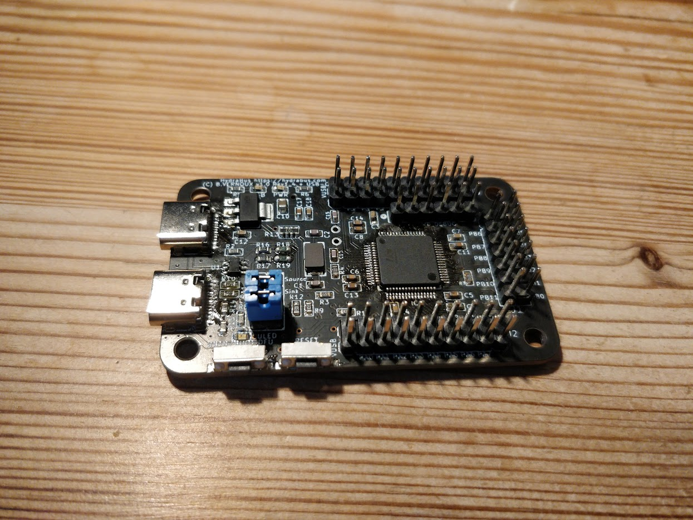

HydraBus Rev 1.4 with USB-C
========

This is a modified version of the Rev 1.4 with USB-C connectors instead of micro-USB.

The second connector had OTG-support. I could not see I would have much use for that so I forced the connector to act as a sink using the bridged jumper underneath the board. To make it possible to configure this though the jumper can be cut and pin headers soldered to enable sink/source selection. **These headers must not be used unless the jumper is cut or there will be a short.** There are ofcourse ICs to do this selection from the STM32 using the same pin previously used for USBID on the micro-connector but I did not find that necessary.

It is worth noting that in order to fit the components I had to move some stuff around. The routing in this modified version is much worse than that in the original. This is especially noteworthy for the differential USB communication lines which have not been tuned. So far everything seems to work fine though.

For licensing etc, please see the [original HydraBus repository](https://github.com/hydrabus/hydrabus).

Thank you to HydraBus for an amazing product.
